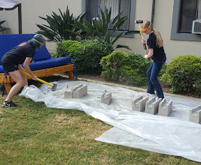

#"Bomb" Diffusal for Caltech Ditch Day 2016

##Background
Caltech's version of senior ditch day is quite different from what you'd expect. Usually, ditch day is a day where seniors ditch their classes to go do fun things away from school. It used to be like that at Caltech, but the underclassmen started to break into seniors' rooms while they were gone to pull pranks on them (pranking is another long held Caltech tradition).

Soon, seniors began to build physical stacks of stuff behind/in front of their doors to deter underclassmen from entering on ditch day. Over time, this evolved into seniors preparing a day of fun and challenging activities for the underclassmen to enjoy.

During Spring 2016, I worked with three other members of my house to create a "Mission Impossible: The Resistance" themed stack. The underclassmens' day was filled with spy-inspired activities, culminating in an afternoon at a ropes course.

Part of the stack that I created required participants to defuse a "bomb". The clues to defuse it were hidden inside concrete cinder blocks that needed to be smashed.

##The "Bomb"

The "bomb" itself is relatively simple. It consists of an Atmega 328, some buttons, some wire, and an LCD screen in a nice enclosure.

In order to keep the front side looking nice, most of the connecting wires are hidden on the back side of the protoboard.

Parts List:

* 1 x [Sparkfun Big Red Box enclosure](https://www.sparkfun.com/products/11366)
* 1 x [Sparkfun Big Red Box Protoboard](https://www.sparkfun.com/products/13317)
* 1 x [Sparkfun Tactile Button Assortment](https://www.sparkfun.com/products/10302)
* 1 x [16x2 LCD Module](https://www.amazon.com/gp/product/B004MGPALC/ref=oh_aui_detailpage_o09_s00?ie=UTF8&psc=1)
* 1 x [10k Trimpot](https://www.sparkfun.com/products/9806) for LCD module
* 4 x 3 Hole, 5mm pitch screw terminal block
  * I bought [this](https://www.amazon.com/gp/product/B00EZ3QUAM) pack
* An Arduino
	* I built one onto the protoboard, but something like an Arduino Pro Mini might be easier.
* Power Source
	* I used a [2 cell LiFe](http://www.hobbyking.com/hobbyking/store/__16807__ZIPPY_Flightmax_700mAh_6_6V_5C_LiFePo4_Receiver_Pack_US_Warehouse_.html) battery pack since it already had a nice 2.5mm pitch connector that I could plug directly into the power headers I put on my board, but anything ought to work.
* Miscellaneous colored wire